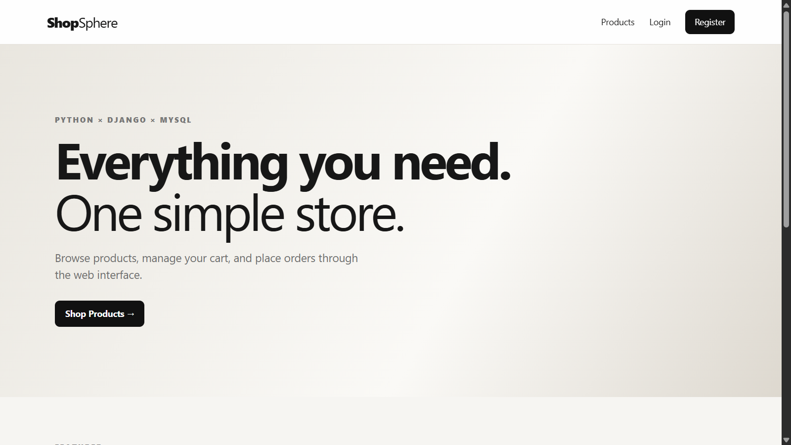
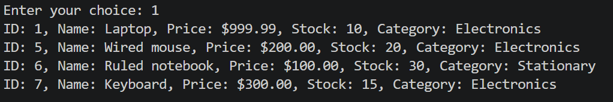
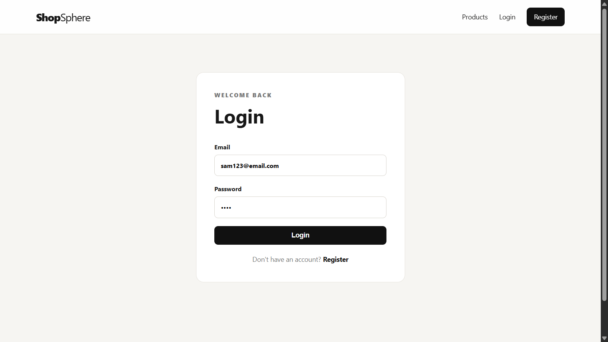
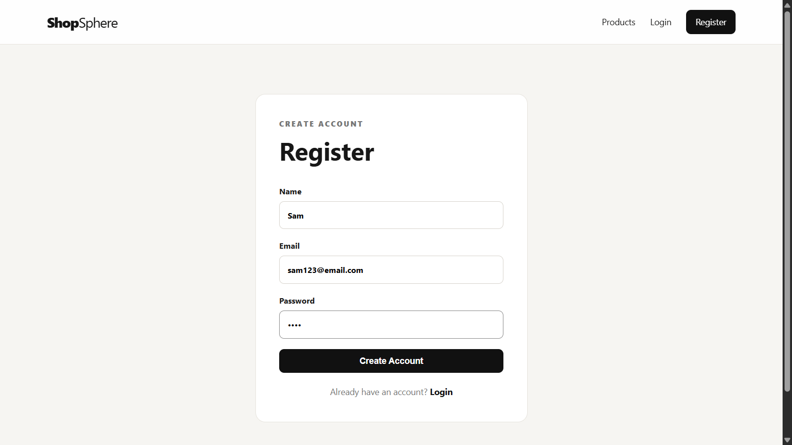
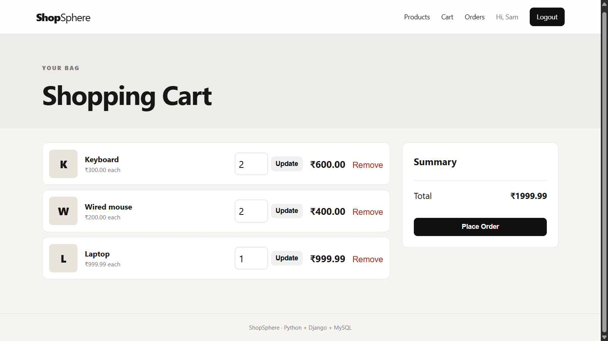
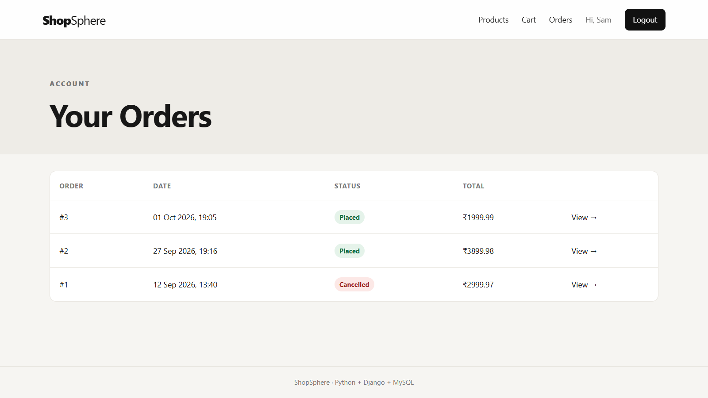

# Python E-Commerce System

A full-stack e-commerce application built with **Python, MySQL, and Django**, featuring both a console-based application and a web-based GUI.

## 🖥️ Web Interface

The project includes a Django-based web interface connected to the MySQL e-commerce database.

### Web Features

* User registration and login
* Secure password hashing
* Product browsing and search
* Product details
* Shopping cart management
* Quantity updates and item removal
* Checkout and order placement
* Order history
* Order details
* Order cancellation
* Stock management
* Responsive web interface

## 📸 Screenshots

### Home Page



### Products



### Login



### Register



### Shopping Cart



### Orders



## ✨ Console Application Features

The original project also includes a Python console-based e-commerce application.

* User registration and login
* Product management
* Product search
* Shopping cart management
* Order placement
* Order cancellation
* Order history
* MySQL database integration
* CRUD operations

## 🛠️ Technologies Used

* **Python**
* **Django**
* **MySQL**
* **HTML**
* **CSS**
* **JavaScript**
* **Git**
* **GitHub**

## 🏗️ Project Structure

```text
python-ecommerce-system/
│
├── console_app/
│   ├── main.py
│   ├── database.py
│   ├── product.py
│   ├── user.py
│   ├── cart.py
│   └── order.py
│
├── django_web/
│   ├── manage.py
│   ├── config/
│   ├── shop/
│   ├── templates/
│   └── static/
│
├── screenshots/
│   ├── home.png
│   ├── products.png
│   ├── login.png
│   ├── register.png
│   ├── cart.png
│   └── order.png
│
├── README.md
└── .gitignore
```

## 🗄️ Database

The application uses **MySQL** as its primary database.

### Main Tables

* `users`
* `products`
* `cart`
* `orders`
* `order_items`

The Django web interface connects to the existing MySQL e-commerce database.

## ⚙️ Setup

### 1. Clone the Repository

```bash
git clone https://github.com/bharatsg85/python-ecommerce-system.git
cd python-ecommerce-system
```

### 2. Console Application

Create and activate a virtual environment:

```bash
python -m venv venv
venv\Scripts\activate
```

Install the required packages:

```bash
pip install mysql-connector-python
```

Configure your MySQL database connection and run:

```bash
cd console_app
python main.py
```

### 3. Django Web Application

Move into the Django project:

```bash
cd django_web
```

Create and activate a virtual environment if needed:

```bash
python -m venv venv
venv\Scripts\activate
```

Install the required packages:

```bash
pip install -r requirements.txt
```

Create a `.env` file using `.env.example` and configure your MySQL credentials.

Run Django migrations:

```bash
python manage.py migrate
```

Start the development server:

```bash
python manage.py runserver
```

Open the local server in your browser:

```text
http://127.0.0.1:8000/
```

## 📚 Concepts Demonstrated

* Python fundamentals
* Object-Oriented Programming
* Functions and modules
* CRUD operations
* SQL
* MySQL database integration
* Database relationships
* Transactions
* Authentication
* Password hashing
* Django MVT architecture
* HTML/CSS/JavaScript
* Git and GitHub

## 🚀 Future Improvements

* Payment gateway integration
* Product reviews and ratings
* Admin dashboard improvements
* User profile management
* Product categories and filtering
* Deployment with a production database
* REST API integration

## 👨‍💻 Author

**Bharat Gurjar**

* GitHub: [@bharatsg85](https://github.com/bharatsg85)
* LinkedIn: [Bharat Gurjar](https://www.linkedin.com/in/bharat-gurjar-35a447403)
* GeeksforGeeks: [@bharatgur3su2](https://www.geeksforgeeks.org/user/bharatgur3su2/)

⭐ If you find this project useful, feel free to explore the repository.
